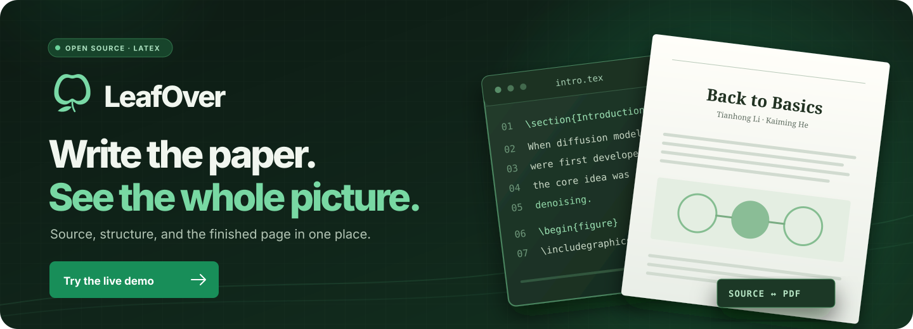

<p align="center"></p>
<h1 align="center">LeafOver</h1>
<p align="center">Work with your coding agent in the terminal. See its LaTeX edits become a live PDF.</p>
<p align="center">
  <a href="https://yaoliliu.github.io/LeafOver/"><strong>▶ Try the interactive demo</strong></a>
  &nbsp;·&nbsp; <a href="#quick-start">Quick start</a>
  &nbsp;·&nbsp; <a href="#features">Features</a>
</p>

<p align="center"><a href="https://yaoliliu.github.io/LeafOver/"></a></p>

LeafOver puts a project terminal, LaTeX source, and live PDF preview in one
workspace. Work with your coding agent in the terminal while its edits compile
and appear beside you. The [live demo](https://yaoliliu.github.io/LeafOver/)
lets you explore JiT's real LaTeX source and all 18 PDF pages. Browser edits
stay in that browser; install LeafOver locally to run terminal commands, compile,
and write project files. The app uses Python's standard library and bundled
browser assets, with no frontend build or CDN required.

## Quick start

Requirements: Python 3.10+ and Debian/Ubuntu or macOS. The installer adds the TeX
packages needed by the bundled paper if they are missing; this may require sudo
on Linux or [Homebrew](https://brew.sh/) on macOS.

```bash
./install.sh
```

Open http://127.0.0.1:8877/. Use the gear to select the main file, compiler and title.
Missing compilers can be installed from the settings dialog on supported systems;
see [compiler management](tools/LEAFOVER.md).
After installation, `python3 run.py` starts the app directly. Use `./install.sh --check`
to inspect dependencies without installing, or `./install.sh --install-only` to
install without starting the app. Server options such as `--port 8878` pass through
to the launcher.

The bundled example is the TeX source of [JiT — Back to Basics: Let Denoising
Generative Models Denoise](https://arxiv.org/abs/2511.13720v2) by Tianhong Li and
Kaiming He, imported from the pinned arXiv v2 source into `examples/jit/`.
It includes small TeX compatibility changes recorded in `examples/jit/SOURCE.json`.
The original download archive is not needed to run or build the example.

To open your own project or use a different port:

```bash
python3 run.py /path/to/latex-project --port 8878
```

The first PDF builds automatically. Later source changes also compile automatically.
The default bind address is localhost. The app edits files and can run terminal
commands; keep it local, or place it behind authenticated access. Remote binding
disables the terminal by default. To enable it through a remote proxy, set
`PAPER_PREVIEW_TERMINAL_ALLOW_REMOTE=1`. An access key is optional, but recommended
when others can reach the proxy: without one, anyone with the URL can run commands.

```bash
export PAPER_PREVIEW_TERMINAL_TOKEN="$(python3 -c 'import secrets; print(secrets.token_urlsafe(32))')"
printf 'Terminal key: %s\n' "$PAPER_PREVIEW_TERMINAL_TOKEN"
PAPER_PREVIEW_TERMINAL_ALLOW_REMOTE=1 python3 run.py --host 0.0.0.0 --port 8878
```

## Features

- Project terminal for coding agents, with live PDF updates as they edit
- Source editor, multiple tabs, autosave and conflict detection
- Live PDF preview, clickable references and PDF-to-source navigation
- Project, source and PDF search
- Persistent project settings and three LaTeX engines
- Dark/light themes, accent colors and Chinese/English interface
- Source/PDF export

## Layout

```text
run.py                 Launcher; accepts any local paper directory
install.sh             Checks dependencies, installs missing TeX tools and starts the app
tools/                Server, interface and bundled browser libraries
tests/                Backend and interaction regression checks
examples/jit/         JiT example project, separate from application code
docs/                 Static GitHub Pages showcase
```

## Development

```bash
python3 -m unittest discover -s tests -p 'test_*.py'
node tests/check_settings_latency.js
```

Node.js is only needed for the JavaScript regression test. The app itself has no
Node.js or pip dependencies. Build outputs and caches are excluded from Git.

## Attribution

LeafOver code is MIT licensed. Third-party browser libraries and the JiT paper
retain their own licenses; see [THIRD_PARTY_NOTICES.md](THIRD_PARTY_NOTICES.md).
